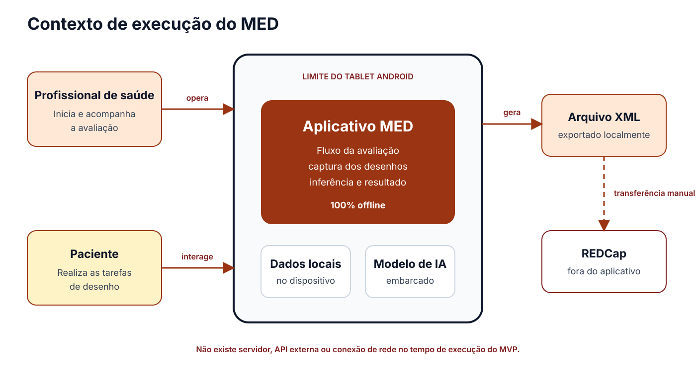
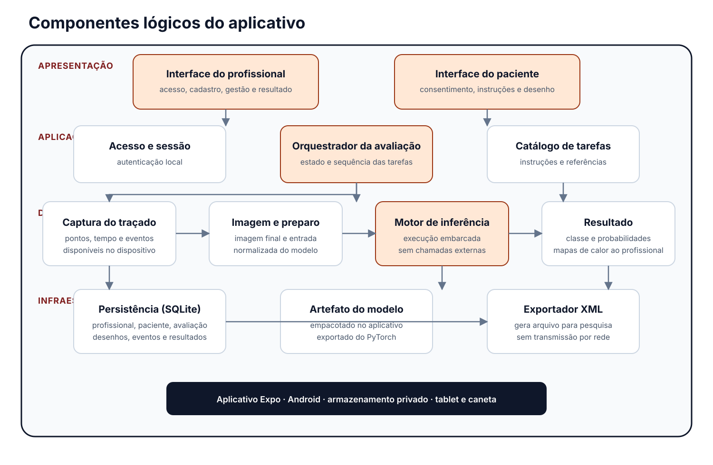
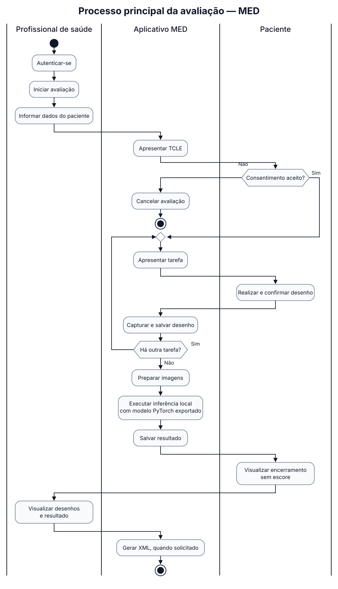
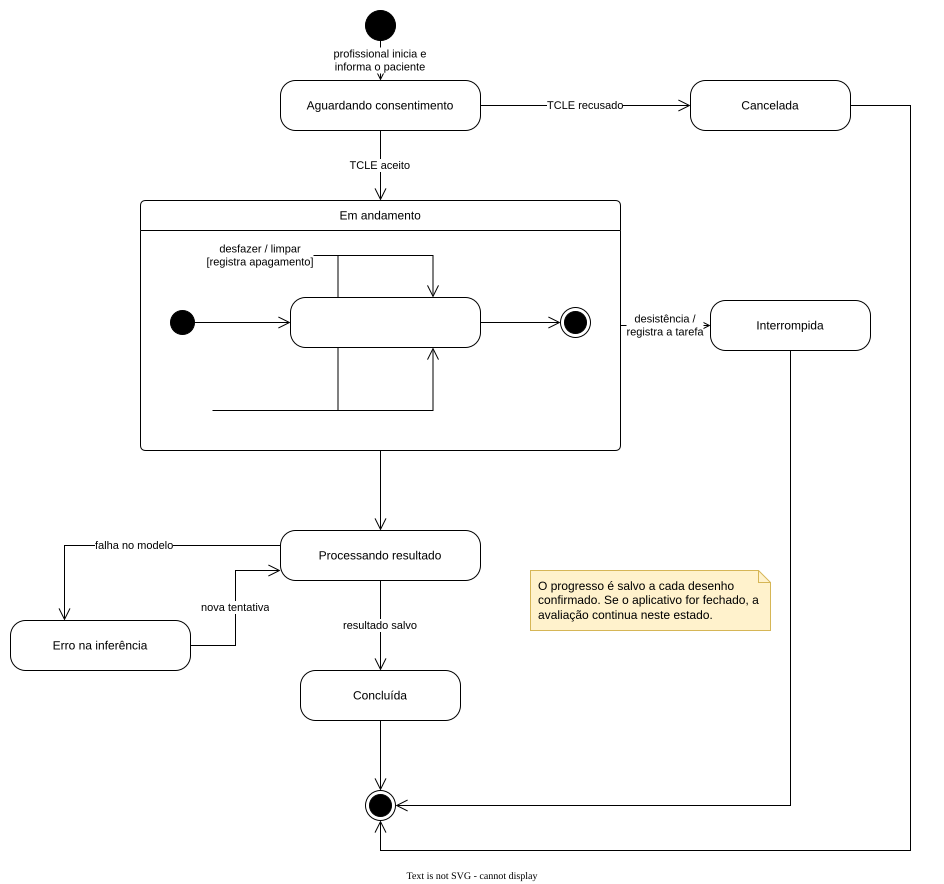
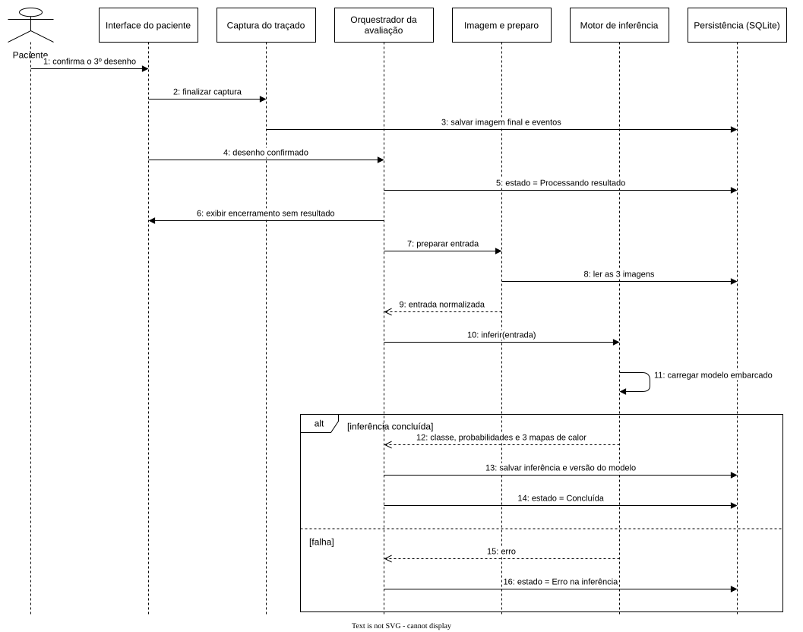
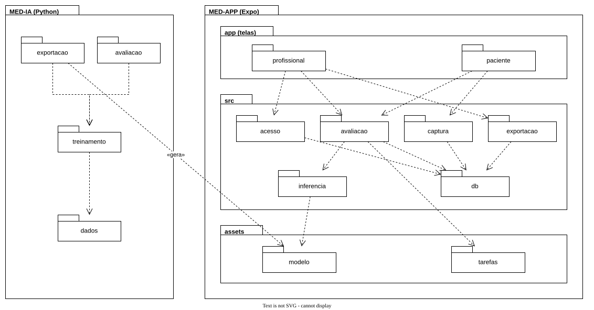
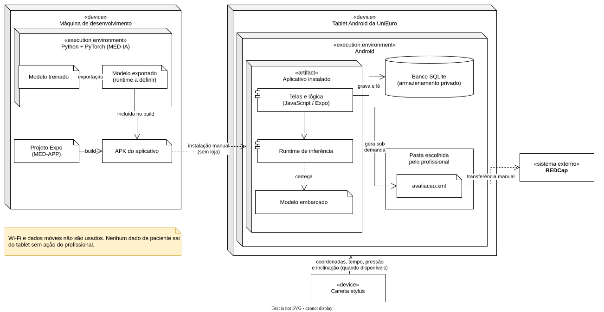
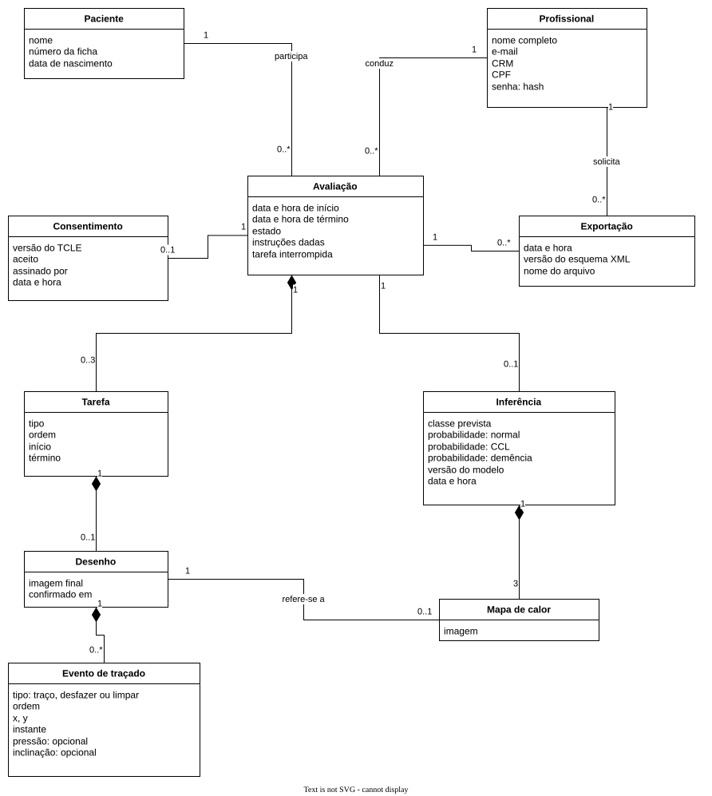

# Arquitetura do Sistema

## 1. Introdução

### 1.1 Finalidade

Este documento descreve a arquitetura do MVP do aplicativo de rastreio cognitivo desenvolvido para a UniEuro. O aplicativo aplica três tarefas de desenho em um tablet Android e usa um modelo de inteligência artificial executado no próprio aparelho para classificar o resultado em normal, comprometimento cognitivo leve (CCL) ou demência. A classificação, a probabilidade e os mapas de calor dos desenhos são apresentados apenas ao profissional de saúde.

O produto ainda não tem nome definido. O cliente ficou de levar o tema ao professor responsável na UniEuro ([Ata 02](../atas-reunioes/Ata-02-EPS-2026-08-24-PO.md), [Ata 06](../atas-reunioes/Ata-06-EPS-2026-09-15-PO.md)). Por isso, este documento se refere a ele apenas como "aplicativo". O sufixo MED nos nomes dos repositórios identifica o projeto e não deve ser lido como nome do produto.

### 1.2 Escopo

O documento segue o modelo 4+1 adaptado, da mesma forma que foi feito no semestre anterior da disciplina, e cobre:

1. visão geral e contexto de uso;
2. estilo arquitetural adotado;
3. visão lógica, com os componentes do aplicativo;
4. visão de processos, com o fluxo da avaliação, os estados da avaliação e a sequência da inferência;
5. visão de implementação, com os repositórios e os pacotes;
6. visão de implantação, com os dispositivos e artefatos;
7. visão de dados, que substitui a visão de casos de uso.

### 1.3 Definições e siglas

| Termo | Significado |
|---|---|
| APK | Pacote de instalação de aplicativos Android |
| Avaliação | Uma aplicação completa do teste para um paciente |
| CCL | Comprometimento cognitivo leve |
| Expo | Plataforma para desenvolver aplicativos React Native, usada no aplicativo |
| Backend | Servidor separado do aplicativo, acessado pela rede, que concentra regras de negócio, dados ou processamento. O aplicativo não tem backend |
| Inferência | Execução do modelo treinado sobre os três desenhos para obter a classificação |
| LGPD | Lei Geral de Proteção de Dados Pessoais (Lei nº 13.709/2018) |
| Mapa de calor | Imagem sobre o desenho que destaca os traços que mais pesaram na classificação |
| Monólito | Sistema construído e implantado como uma única aplicação |
| REDCap | Plataforma de gestão de dados de pesquisa usada pelo cliente |
| Runtime do modelo | Biblioteca que carrega o arquivo do modelo exportado e executa a inferência no tablet |
| SQLite | Banco de dados relacional em arquivo, usado no tablet |
| TCLE | Termo de Consentimento Livre e Esclarecido |
| XML | Formato de arquivo usado para exportar os dados da avaliação |

### 1.4 Fontes

As decisões registradas aqui vêm da [Visão do Produto](visao.md), da [Lean Inception](lean-inception.md), do [Sequenciador](sequenciador.md) e das atas de reunião com o *Product Owner* e o cliente, principalmente as [Atas 02](../atas-reunioes/Ata-02-EPS-2026-08-24-PO.md), [03](../atas-reunioes/Ata-03-EPS-2026-08-31-PO.md), [04](../atas-reunioes/Ata-04-EPS-2026-09-11-PO.md) e [06](../atas-reunioes/Ata-06-EPS-2026-09-15-PO.md).

## 2. Visão geral

O aplicativo roda em um dos dois tablets Android que a UniEuro está adquirindo para a pesquisa ([Ata 03](../atas-reunioes/Ata-03-EPS-2026-08-31-PO.md)). O profissional de saúde e o paciente usam o mesmo aparelho em momentos diferentes. O profissional faz login, cadastra o paciente e entrega o tablet. O paciente, ou seu responsável legal, aceita o TCLE e faz os desenhos. Ao final, o profissional recebe o tablet de volta e consulta o resultado.

**Figura 1:** Diagrama de contexto



**Fonte:** [Daniel Ferreira Nunes](https://github.com/Mach1r0), 2026, com ajustes de [Gabriel Lopes de Amorim](https://github.com/BrzGab).

| Elemento | Papel |
|---|---|
| Profissional de saúde | Cria a própria conta, conduz a avaliação, consulta o resultado e exporta o XML. Na prática pode ser médico, enfermeiro ou auxiliar de enfermagem ([Ata 03](../atas-reunioes/Ata-03-EPS-2026-08-31-PO.md)) |
| Paciente | Pessoa com 60 anos ou mais que aceita o TCLE e faz os desenhos. Não faz login e não vê o resultado |
| Responsável legal | Assina o TCLE quando o paciente não pode assinar, por exemplo no caso de paciente analfabeto ([Ata 04](../atas-reunioes/Ata-04-EPS-2026-09-11-PO.md)) |
| Aplicativo | Conduz a avaliação, guarda os dados no tablet, executa a inferência e gera o XML |
| REDCap | Recebe o XML importado manualmente pela equipe de pesquisa. Não existe integração direta |

Não há super usuário. O profissional recebe o tablet já configurado e cria a própria conta ([Ata 03](../atas-reunioes/Ata-03-EPS-2026-08-31-PO.md)).

## 3. Estilo arquitetural

O aplicativo segue o estilo **monólito modular em camadas**. Esta seção explica esse modelo arquitetural. As visões das seções seguintes mostram como ele se aplica ao aplicativo.

### 3.1 Características

- **Monólito:** todo o sistema é uma única aplicação Expo, compilada em um único APK e executada em um único processo no tablet. Não há serviços separados, backend nem comunicação por rede entre partes do sistema.
- **Modular:** o código é dividido em módulos por responsabilidade do negócio (`acesso`, `avaliacao`, `captura`, `inferencia` e `exportacao`), mais o módulo `db`, de persistência. Cada módulo expõe uma interface pública e esconde sua implementação dos demais.
- **Em camadas:** os componentes são organizados em quatro camadas (apresentação, aplicação, domínio e processamento e infraestrutura local), e cada camada só depende das camadas abaixo dela. As telas, por exemplo, usam os módulos de `src` e não acessam o banco diretamente.

O repositório de IA não é um serviço do sistema. Ele é um projeto de treino que roda fora do tablet e gera um artefato, o arquivo do modelo, que é empacotado no aplicativo. Em execução, o modelo é apenas mais um recurso local do monólito.

### 3.2 Módulos e camadas

| Módulo | Componentes | Camadas |
|---|---|---|
| `acesso` | Acesso e sessão | Aplicação |
| `avaliacao` | Orquestrador da avaliação, Catálogo de tarefas | Aplicação |
| `captura` | Captura do traçado, Imagem e preparo | Domínio e processamento |
| `inferencia` | Motor de inferência, Resultado | Domínio e processamento |
| `exportacao` | Exportador XML | Infraestrutura local |
| `db` | Persistência (SQLite) | Infraestrutura local |

As interfaces do profissional e do paciente ficam na pasta `app` e formam a camada de apresentação. O artefato do modelo fica em `assets/modelo` e é carregado pelo módulo `inferencia`. As figuras de referência do catálogo de tarefas ficam em `assets/tarefas`.

### 3.3 Justificativa

| Alternativa | Motivo da escolha ou do descarte |
|---|---|
| Monólito modular em camadas | Adotado. Atende à execução 100% offline em um único aparelho, é simples de construir, testar e instalar por APK, e a divisão em módulos permite que a equipe trabalhe em partes diferentes com pouco conflito |
| Cliente-servidor ou microsserviços | Descartados. Exigiriam servidor e rede, o que contraria a restrição de funcionamento offline e traria custo de infraestrutura que ninguém assumiria ([Ata 02](../atas-reunioes/Ata-02-EPS-2026-08-24-PO.md), [Ata 03](../atas-reunioes/Ata-03-EPS-2026-08-31-PO.md)) |
| API local dentro do tablet | Descartada. Não traria ganho que justificasse a complexidade ([Ata 03](../atas-reunioes/Ata-03-EPS-2026-08-31-PO.md)) |
| Monólito sem divisão em módulos | Descartado. Misturaria telas, regra da avaliação, inferência e persistência, dificultando a troca do modelo e do runtime, que ainda estão em definição |

A separação em módulos também prepara o aplicativo para mudanças previstas: o runtime do modelo e a estratégia de pré-processamento podem mudar sem afetar as telas nem o fluxo da avaliação, desde que o contrato da [seção 6.3](#63-contrato-entre-aplicativo-e-modelo) seja mantido.

## 4. Visão lógica

A visão lógica mostra como o aplicativo está dividido em componentes e quais dependências existem entre eles. Não existe backend separado: todos os componentes rodam dentro do aplicativo Expo, no tablet. A divisão em quatro camadas mantém as interfaces separadas da regra da avaliação e isola o motor de inferência, que depende do trabalho do repositório de IA.

**Figura 2:** Diagrama de componentes do aplicativo



**Fonte:** [Daniel Ferreira Nunes](https://github.com/Mach1r0), 2026, com ajustes de [Gabriel Lopes de Amorim](https://github.com/BrzGab).

| Camada | Componente | Responsabilidade |
|---|---|---|
| Apresentação | Interface do profissional | Cadastro, login, dados do paciente, resultado, registro das instruções dadas e exportação |
| Apresentação | Interface do paciente | TCLE, instrução de cada tarefa, área de desenho, botão de desistência e encerramento sem resultado |
| Aplicação | Acesso e sessão | Autenticação local do profissional e bloqueio da área do profissional enquanto o paciente usa o tablet |
| Aplicação | Orquestrador da avaliação | Controla a ordem das tarefas, os estados da avaliação e a desistência |
| Aplicação | Catálogo de tarefas | Instruções e figuras de referência das três tarefas |
| Domínio e processamento | Captura do traçado | Registra pontos, tempo, apagamentos e as métricas da caneta disponíveis no aparelho |
| Domínio e processamento | Imagem e preparo | Gera a imagem final e converte as três imagens no formato de entrada do modelo |
| Domínio e processamento | Motor de inferência | Carrega o modelo embarcado e devolve a classe prevista, a probabilidade de cada classe e um mapa de calor por desenho |
| Domínio e processamento | Resultado | Organiza a classe, as probabilidades e os mapas de calor para a interface do profissional |
| Infraestrutura local | Persistência (SQLite) | Leitura e gravação dos dados no banco SQLite |
| Infraestrutura local | Artefato do modelo | Arquivo do modelo exportado do PyTorch, empacotado no aplicativo |
| Infraestrutura local | Exportador XML | Monta o arquivo XML quando o profissional pede |

### 4.1 Requisitos e restrições de arquitetura

1. Todo o processamento acontece no tablet, sem servidor, API externa, Wi-Fi ou dados móveis ([Ata 03](../atas-reunioes/Ata-03-EPS-2026-08-31-PO.md)).
2. A LGPD é tratada como requisito não funcional, mesmo com o sistema offline ([Ata 02](../atas-reunioes/Ata-02-EPS-2026-08-24-PO.md)).
3. O resultado nunca aparece nas telas do paciente.
4. Depois que o teste começa, o paciente não pode voltar para a área do profissional ([Ata 04](../atas-reunioes/Ata-04-EPS-2026-09-11-PO.md)).
5. O aplicativo salva todas as métricas de traçado que o conjunto de tablet e caneta fornecer: coordenadas, tempo, velocidade (calculada a partir das coordenadas e do tempo) e, quando houver, pressão e inclinação ([Ata 04](../atas-reunioes/Ata-04-EPS-2026-09-11-PO.md)). Esses dados vão para o XML. O modelo usa somente as imagens finais, porque o dataset não tem dados de caneta ([Ata 03](../atas-reunioes/Ata-03-EPS-2026-08-31-PO.md)).
6. Apagamentos e desistências são registrados pelo próprio aplicativo, sem anotação manual ([Ata 06](../atas-reunioes/Ata-06-EPS-2026-09-15-PO.md)).
7. O progresso da avaliação é salvo no tablet, conforme a onda 2 do [Sequenciador](sequenciador.md).

## 5. Visão de processos

### 5.1 Fluxo da avaliação

O diagrama de atividades segue o fluxo descrito pelo *Product Owner* na [Ata 04](../atas-reunioes/Ata-04-EPS-2026-09-11-PO.md) e inclui o botão de desistência e o registro das instruções definidos na [Ata 06](../atas-reunioes/Ata-06-EPS-2026-09-15-PO.md).

**Figura 3:** Diagrama de atividades da avaliação



**Fonte:** [Daniel Ferreira Nunes](https://github.com/Mach1r0), 2026, com ajustes de [Gabriel Lopes de Amorim](https://github.com/BrzGab). [Consultar a fonte PlantUML](../assets/imagens/arquitetura/diagrama-atividades-med.puml).

1. O profissional faz login, inicia a avaliação e informa nome, número da ficha e data de nascimento do paciente.
2. O aplicativo bloqueia a área do profissional e exibe o TCLE.
3. Se o termo for recusado, a recusa é registrada e a avaliação é cancelada.
4. Para cada uma das três tarefas, o aplicativo mostra a instrução e o paciente desenha. O paciente pode desfazer o último traço ou limpar a área, e cada apagamento fica registrado.
5. Se o paciente desistir, o aplicativo registra a desistência e a tarefa em que ele parou.
6. Cada desenho confirmado é salvo com a imagem final e o traçado.
7. O paciente vê a tela de encerramento, sem resultado.
8. Se os três desenhos foram confirmados, o aplicativo executa a inferência e salva a classe prevista, as probabilidades, os mapas de calor e a versão do modelo.
9. O profissional volta à sua área, registra se deu instruções durante o teste e quais foram, consulta os desenhos com os mapas de calor e o resultado e, se quiser, gera o XML.

### 5.2 Estados da avaliação

A avaliação passa por estados bem definidos. Guardar o estado no banco permite retomar uma avaliação quando o aplicativo é fechado no meio do teste e contar desistências por tarefa, que é uma das métricas do [Canvas MVP](canvas-mvp.md).

**Figura 4:** Diagrama de estados da avaliação



**Fonte:** [Gabriel Lopes de Amorim](https://github.com/BrzGab), 2026.

| Estado | Quando ocorre |
|---|---|
| Aguardando consentimento | O profissional informou os dados do paciente e o TCLE está na tela |
| Em andamento | O TCLE foi aceito e o paciente está fazendo as tarefas |
| Processando resultado | Os três desenhos foram confirmados e a inferência está em execução |
| Erro na inferência | O modelo falhou. A inferência pode ser executada de novo, porque os desenhos já estão salvos |
| Concluída | O resultado foi salvo |
| Cancelada | O TCLE foi recusado |
| Interrompida | O paciente desistiu. A tarefa em que ele parou fica registrada |

### 5.3 Sequência da inferência

O diagrama de sequência detalha o trecho entre a confirmação do último desenho e o registro do resultado. A tela de encerramento aparece antes da inferência terminar, para que o paciente não espere pelo processamento.

**Figura 5:** Diagrama de sequência da inferência



**Fonte:** [Gabriel Lopes de Amorim](https://github.com/BrzGab), 2026.

## 6. Visão de implementação

### 6.1 Tecnologias

A tecnologia definida a princípio pela equipe é:

| Parte | Tecnologia | Onde roda |
|---|---|---|
| Aplicativo (telas e lógica) | Expo (React Native) | Tablet |
| Banco de dados | SQLite, acessado pelo `expo-sqlite` | Tablet |
| Modelo de IA (treino e exportação) | PyTorch, com Python | Máquina de desenvolvimento |
| Modelo de IA (execução) | Runtime do modelo, a definir (ver [Pendências](#10-pendencias)) | Tablet |

Não existe backend separado. O Python é usado apenas no repositório de IA, para tratar o dataset, treinar, avaliar e exportar o modelo. No tablet, o modelo exportado é executado pelo próprio aplicativo, sem servidor local nem chamada de rede. Isso segue o que foi discutido na [Ata 03](../atas-reunioes/Ata-03-EPS-2026-08-31-PO.md): uma API rodando dentro do tablet não traria ganho que justificasse a complexidade.

### 6.2 Repositórios e pacotes

| Repositório | Responsabilidade |
|---|---|
| `2026.2-UNB-FCTE_UNIEURO_MED-APP` | Aplicativo Expo: telas, fluxo da avaliação, captura, banco SQLite, inferência e exportação |
| `2026.2-UNB-FCTE_UNIEURO_MED-IA` | Tratamento do dataset, treino, avaliação e exportação do modelo com Python e PyTorch |
| `2026.2-UNB-FCTE_UNIEURO_MED-DOCS` | Documentação do produto e do processo, site MkDocs e dashboard |

Os repositórios de código ainda não têm implementação. Os pacotes abaixo são uma proposta de organização e devem ser revisados quando o projeto Expo for criado.

**Figura 6:** Diagrama de pacotes



**Fonte:** [Gabriel Lopes de Amorim](https://github.com/BrzGab), 2026.

```text
MED-APP
├── app                # telas (Expo Router)
│   ├── profissional
│   └── paciente
├── src
│   ├── acesso
│   ├── avaliacao
│   ├── captura
│   ├── inferencia
│   ├── exportacao
│   └── db             # expo-sqlite
└── assets
    ├── modelo         # arquivo gerado pelo MED-IA
    └── tarefas

MED-IA
├── dados
├── treinamento
├── avaliacao
└── exportacao
```

As telas em `app` correspondem às interfaces do profissional e do paciente. Elas só dependem dos módulos de `src` e não acessam o banco diretamente. O pacote `assets/modelo` recebe o arquivo gerado por `exportacao` no MED-IA. Essa é a única ligação entre os dois repositórios.

### 6.3 Contrato entre aplicativo e modelo

O modelo recebe as três imagens (relógio, cubo e a figura geométrica) e devolve:

- a probabilidade de cada classe (normal, CCL e demência);
- a classe prevista, por exemplo "0,91 → CCL";
- três mapas de calor, um por desenho, mostrando os traços que mais influenciaram a decisão.

O modelo não gera um escore numérico como os testes em papel. Estão em estudo duas estratégias: três CNNs com mecanismo de atenção, como no artigo do dataset, ou as três imagens em escala de cinza combinadas como canais de uma única imagem ([Ata 03](../atas-reunioes/Ata-03-EPS-2026-08-31-PO.md)). A estratégia escolhida muda o pré-processamento, então o contrato abaixo deve ser versionado junto com o modelo:

- ordem das três imagens na entrada;
- dimensões, número de canais e normalização;
- formato do arquivo exportado e runtime usado no aplicativo;
- ordem das classes na saída e formato dos mapas de calor;
- versão do modelo, que é gravada junto com cada inferência.

## 7. Visão de implantação

Em produção existe um único nó de execução, o tablet. A máquina de desenvolvimento aparece no diagrama porque é onde o modelo é treinado e exportado antes de entrar no APK.

**Figura 7:** Diagrama de implantação



**Fonte:** [Gabriel Lopes de Amorim](https://github.com/BrzGab), 2026, adaptado do diagrama original de [Daniel Ferreira Nunes](https://github.com/Mach1r0).

- O modelo é treinado com Python e PyTorch, exportado e incluído no APK durante o build do projeto Expo.
- O APK é instalado manualmente nos tablets, sem publicação em loja ([Lean Inception](lean-inception.md#2-e-nao-e-faz-nao-faz)).
- O banco SQLite, as imagens e os traçados ficam no armazenamento privado do aplicativo, que outros aplicativos não conseguem ler.
- O XML precisa ser gravado em uma pasta escolhida pelo profissional. Se ficasse no armazenamento privado, não seria possível copiá-lo para o REDCap.
- A inferência roda no tablet, sem chamadas de rede.

## 8. Visão de dados

O banco SQLite guarda os dados abaixo. Os campos de cadastro são os definidos pelo cliente na [Ata 06](../atas-reunioes/Ata-06-EPS-2026-09-15-PO.md). Os dados exportados no XML são os pedidos na [Ata 04](../atas-reunioes/Ata-04-EPS-2026-09-11-PO.md): dados do traçado, inferência, horário, profissional e paciente.

**Figura 8:** Modelo conceitual de dados



**Fonte:** [Gabriel Lopes de Amorim](https://github.com/BrzGab), 2026.

| Entidade | Dados principais |
|---|---|
| Profissional | Nome completo, e-mail, CRM, CPF e senha armazenada como hash |
| Paciente | Nome, número da ficha e data de nascimento |
| Avaliação | Início, término, estado, instruções dadas durante o teste e tarefa interrompida, se houver |
| Consentimento | Versão do TCLE, aceite, quem assinou (paciente ou responsável) e horário |
| Tarefa | Tipo, ordem, início e término |
| Desenho | Imagem final e horário da confirmação |
| Evento de traçado | Tipo (traço, desfazer ou limpar), ordem, coordenadas, instante e, quando disponíveis, pressão e inclinação |
| Inferência | Classe prevista, probabilidade de cada classe, versão do modelo e horário |
| Mapa de calor | Imagem gerada pelo modelo para um dos desenhos |
| Exportação | Horário, versão do esquema XML e nome do arquivo |

Relações principais:

- um profissional conduz várias avaliações, e um paciente pode participar de várias;
- uma avaliação tem no máximo três tarefas, pois uma avaliação interrompida pode ter menos;
- cada tarefa tem no máximo um desenho confirmado, com vários eventos de traçado;
- uma avaliação tem no máximo uma inferência, que só existe quando os três desenhos foram confirmados;
- cada inferência tem três mapas de calor, e cada mapa se refere a um desenho;
- uma avaliação pode ser exportada mais de uma vez.

## 9. Decisões arquiteturais

| Decisão | Justificativa | Origem |
|---|---|---|
| Estilo monólito modular em camadas | Um único aplicativo offline, com módulos separados por responsabilidade e cada camada dependendo só das camadas abaixo dela | Definição da equipe, [seção 3](#3-estilo-arquitetural) |
| Execução 100% local no tablet, sem backend | Custo de infraestrutura que ninguém assumiria e proteção dos dados do paciente | [Ata 02](../atas-reunioes/Ata-02-EPS-2026-08-24-PO.md), [Ata 03](../atas-reunioes/Ata-03-EPS-2026-08-31-PO.md) |
| Aplicativo em Expo (React Native), distribuído como APK | Tablets da UniEuro e escopo sem Web, iOS ou loja | Definição da equipe, [Lean Inception](lean-inception.md) |
| Banco SQLite no tablet | Banco relacional em arquivo, sem servidor, proposto na Ata 02 | [Ata 02](../atas-reunioes/Ata-02-EPS-2026-08-24-PO.md) |
| Modelo treinado em PyTorch e executado no aparelho | Dispensa rede e mantém os dados no tablet | [Visão do Produto](visao.md) |
| Saída do modelo com classe, probabilidades e mapas de calor | O profissional precisa ver o desenho, o motivo da decisão e a margem de erro para confiar no resultado | [Lean Inception](lean-inception.md#4-personas) |
| Resultado visível somente para o profissional | Não constranger o paciente | [Ata 03](../atas-reunioes/Ata-03-EPS-2026-08-31-PO.md) |
| Exportação em XML por ação do profissional | Importação no REDCap pela equipe de pesquisa | [Ata 04](../atas-reunioes/Ata-04-EPS-2026-09-11-PO.md) |
| Salvar todas as métricas de caneta disponíveis | Os dados alimentam a pesquisa mesmo sem entrar no modelo | [Ata 04](../atas-reunioes/Ata-04-EPS-2026-09-11-PO.md) |
| Registro automático de apagamentos e desistências | Métricas do Canvas MVP sem anotação manual | [Ata 06](../atas-reunioes/Ata-06-EPS-2026-09-15-PO.md) |

## 10. Pendências

| Item | Situação |
|---|---|
| Runtime do modelo no aplicativo | Definir como o Expo vai executar o modelo exportado do PyTorch (por exemplo, ExecuTorch ou ONNX Runtime) |
| Proteção do banco no tablet | Definir se o SQLite será criptografado e como a senha do profissional será armazenada |
| Segunda figura das tarefas | As Atas 01 e 03 falam em hexágono, e a página de [Funcionalidades](funcionalidades.md) fala em pentágono. Confirmar com o cliente |
| Termo "escore" nas outras páginas | A [Visão do Produto](visao.md), a [Lean Inception](lean-inception.md) e as [Funcionalidades](funcionalidades.md) falam em escore por tarefa e escore geral. O modelo devolve classe, probabilidades e mapas de calor, então essas páginas precisam ser alinhadas |
| Faixa de incerteza | A probabilidade de cada classe pode cumprir esse papel, como o *Product Owner* sugeriu na [Ata 03](../atas-reunioes/Ata-03-EPS-2026-08-31-PO.md). Confirmar |
| Mapas de calor no MVP | Na [Ata 04](../atas-reunioes/Ata-04-EPS-2026-09-11-PO.md) o mapa de calor foi tratado como adicional pós-MVP. Com a saída atual do modelo, ele passa a fazer parte do resultado. Registrar essa mudança no sequenciador |
| Esquema do XML | Definir campos, versionamento e o que precisa ser anonimizado antes de ir para o REDCap |
| Recuperação de senha | Prevista nas histórias de usuário ([Ata 05](../atas-reunioes/Ata-05-EPS-2026-09-14-PO.md)), mas precisa funcionar sem e-mail ou rede |
| Registro de apagamentos | O cliente ainda vai confirmar se o apagamento deve ser registrado ([Ata 06](../atas-reunioes/Ata-06-EPS-2026-09-15-PO.md)) |

## 11. Riscos e mitigações

| Risco | Mitigação |
|---|---|
| O modelo escolhido não roda no tablet com desempenho aceitável | Testar a exportação e a execução no aparelho logo nas primeiras sprints do MED-IA |
| O runtime do modelo exigir módulo nativo, que não funciona no Expo Go | Usar *development build* do Expo desde o início do projeto |
| Os mapas de calor dependerem de cálculo de gradiente, que o runtime do celular pode não suportar | Exportar o modelo já devolvendo os mapas como saída, e testar isso cedo |
| O aplicativo e o modelo usarem pré-processamentos diferentes | Manter o contrato da [seção 6.3](#63-contrato-entre-aplicativo-e-modelo) versionado junto com o modelo |
| Perda de dados se o tablet quebrar ou for perdido | Orientar a exportação periódica do XML e proteger o banco do aplicativo |
| O paciente acessar dados de outros pacientes | Bloquear a área do profissional durante o teste e exigir autenticação para voltar |
| A caneta não fornecer pressão ou inclinação | Tratar esses campos como opcionais no banco e no XML |

## Histórico de versões

| Versão | Descrição | Autor | Data | Revisor | Data de revisão |
|---|---|---|---|---|---|
| 1.0 | Criação do documento de arquitetura | [Daniel Ferreira Nunes](https://github.com/Mach1r0) | 22/09/2026 | A definir | — |
| 1.1 | Inclusão dos diagramas de atividades e de implantação | [Daniel Ferreira Nunes](https://github.com/Mach1r0) | 22/09/2026 | A definir | — |
| 1.2 | Reorganização do documento nas visões arquiteturais | [Daniel Ferreira Nunes](https://github.com/Mach1r0) | 22/09/2026 | A definir | — |
| 1.3 | Revisão de consistência com as atas e a Visão do Produto, retirada do nome MED como nome do produto e inclusão de introdução, pendências e riscos | [Gabriel Lopes de Amorim](https://github.com/BrzGab) | 23/09/2026 | A definir | — |
| 1.4 | Ajuste dos diagramas de contexto, componentes e atividades, substituição do diagrama de implantação e inclusão dos diagramas de estados, sequência, pacotes e dados | [Gabriel Lopes de Amorim](https://github.com/BrzGab) | 23/09/2026 | A definir | — |
| 1.5 | Registro da tecnologia (Expo, SQLite e PyTorch, sem backend) e da saída do modelo (classe, probabilidades e mapas de calor) | [Gabriel Lopes de Amorim](https://github.com/BrzGab) | 23/09/2026 | A definir | — |
