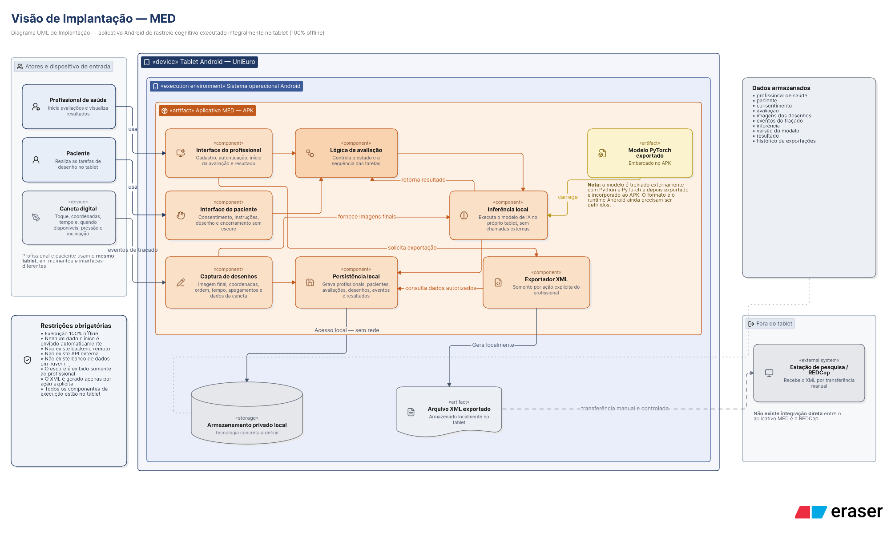

# Arquitetura do Sistema — MED

Este documento apresenta a arquitetura do MVP do MED conforme as visões solicitadas. O sistema apoia o rastreio cognitivo por meio de tarefas de desenho realizadas em um tablet e analisadas por um modelo de inteligência artificial executado localmente.


## 1. Visão geral

O MED é um aplicativo Android utilizado por um profissional de saúde e por um paciente no mesmo tablet. O profissional inicia a avaliação e informa os dados necessários. O paciente aceita o termo de consentimento e realiza as tarefas de desenho. Ao final, o aplicativo executa a inferência localmente e apresenta o resultado somente ao profissional.


### 1.1. Elementos externos

| Elemento | Responsabilidade |
|---|---|
| Profissional de saúde | Iniciar a avaliação, informar os dados e consultar o resultado |
| Paciente | Aceitar o consentimento e realizar as tarefas de desenho |
| Aplicativo MED | Conduzir a avaliação, armazenar os dados, executar a inferência e gerar o XML |
| REDCap | Receber posteriormente o XML por transferência manual, sem integração direta |

### 1.2. Escopo arquitetural

O MVP deve funcionar integralmente offline. A interface, a persistência, a inferência e a exportação residem no tablet. Não fazem parte desta versão servidores, APIs externas, sincronização em nuvem ou integração automática com o REDCap.

## 2. Visão lógica

A visão lógica apresenta os principais componentes do aplicativo e suas responsabilidades.


| Componente | Responsabilidade |
|---|---|
| Interface do profissional | Cadastro, autenticação, início da avaliação e consulta do resultado |
| Interface do paciente | Consentimento, instruções, desenho e encerramento sem exibição do escore |
| Lógica da avaliação | Controlar o estado e a sequência das tarefas |
| Captura de desenhos | Registrar a imagem final, o traçado e os eventos disponíveis da caneta |
| Inferência local | Preparar as imagens, carregar o modelo e calcular o resultado |
| Persistência local | Armazenar e recuperar os dados da avaliação no tablet |
| Exportador XML | Gerar o arquivo solicitado pelo profissional para uso na pesquisa |

## 3. Visão de processos

A visão de processos representa o fluxo principal de uma avaliação e a divisão das ações entre o profissional, o aplicativo e o paciente.


[Consultar a fonte PlantUML](../assets/imagens/arquitetura/diagrama-atividades-med.puml)

### 3.1. Fluxo principal

1. O profissional se autentica, inicia a avaliação e informa os dados do paciente.
2. O aplicativo apresenta o termo de consentimento.
3. Se o consentimento for recusado, a avaliação é cancelada.
4. Se for aceito, o aplicativo apresenta cada tarefa ao paciente.
5. O paciente realiza e confirma o desenho.
6. O aplicativo salva o desenho e repete o processo até concluir as tarefas.
7. As imagens são preparadas e enviadas ao modelo executado no próprio tablet.
8. O resultado e a versão do modelo utilizado são armazenados localmente.
9. O paciente visualiza somente a mensagem de encerramento.
10. O profissional pode consultar os desenhos, o resultado e solicitar a geração do XML.

## 4. Visão de implementação

O projeto é dividido em três repositórios:

| Repositório | Responsabilidade |
|---|---|
| `MED-APP` | Aplicativo Android, interfaces, fluxo da avaliação, armazenamento e inferência local |
| `MED-IA` | Treinamento, avaliação e exportação do modelo desenvolvido com PyTorch |
| `MED-DOCS` | Documentação do produto, do processo e da arquitetura |

### 4.1. Organização dos módulos

```text
MED-APP
├── interfaces
│   ├── profissional
│   └── paciente
├── avaliacao
├── captura
├── inferencia
├── persistencia
└── exportacao-xml

MED-IA
├── treinamento
├── avaliacao
└── exportacao-do-modelo
```

Essa divisão é conceitual e orienta a separação de responsabilidades. O modelo é treinado fora do tablet com Python e PyTorch, exportado em formato compatível com Android e incorporado ao APK. O MVP não possui backend remoto.

### 4.2. Contrato entre aplicativo e modelo

O aplicativo e o modelo devem compartilhar uma especificação versionada contendo:

- identificação e ordem das imagens de entrada;
- dimensões, canais e normalização das imagens;
- formato e versão do modelo exportado;
- nomes, tipos e interpretação das saídas;
- versão do modelo associada a cada resultado.

## 5. Visão de implantação

O sistema possui um único nó de execução: o tablet Android da instituição.



### 5.1. Distribuição dos artefatos

- O APK contém as interfaces, a lógica da avaliação, a captura, a camada de persistência, o exportador XML e o modelo exportado.
- Os registros da aplicação e os arquivos gerados ficam no armazenamento privado do tablet.
- A inferência ocorre no próprio dispositivo, sem chamadas externas.
- O XML é transferido manualmente para a estação de pesquisa ou para o REDCap.

## 6. Visão de dados

Os dados são armazenados localmente e organizados pelas seguintes entidades:

| Entidade | Dados principais | Relação |
|---|---|---|
| Profissional | Identificação e credenciais protegidas | Conduz avaliações |
| Paciente | Identificação e número de ficha | Participa de avaliações |
| Avaliação | Data, estado, consentimento e desistência | Reúne as tarefas realizadas |
| Tarefa | Tipo, ordem, horários e estado | Pertence a uma avaliação |
| Desenho | Imagem final e identificação da tarefa | Pertence a uma tarefa |
| Evento de traçado | Coordenadas, ordem, tempo e atributos disponíveis da caneta | Pertence a um desenho |
| Inferência | Resultado, versão do modelo e horário | Pertence a uma avaliação |
| Exportação | Versão do esquema, data e avaliação de origem | Registra a geração do XML |

### 6.1. Relações principais

- Um profissional conduz várias avaliações.
- Um paciente pode participar de várias avaliações.
- Uma avaliação possui várias tarefas e uma inferência final.
- Uma tarefa possui um desenho e vários eventos de traçado.
- Uma avaliação pode originar exportações XML.

### 6.2. Armazenamento e exportação

Os registros devem permanecer no armazenamento privado do aplicativo. A tecnologia de persistência ainda será definida. O XML é gerado apenas por solicitação do profissional e deve possuir esquema versionado. Dados clínicos, imagens e resultados não devem ser enviados automaticamente para serviços externos.

## 7. Decisões e pendências arquiteturais

| Item | Estado | Definição ou encaminhamento |
|---|---|---|
| Execução integral no tablet | Decidido | Manter o funcionamento offline e sem backend remoto |
| Aplicativo Android | Decidido | Distribuir o sistema como APK no tablet institucional |
| Modelo de IA | Decidido | Treinar com PyTorch e executar o modelo exportado localmente |
| Resultado da avaliação | Decidido | Exibir o escore somente ao profissional |
| Exportação XML | Decidido | Gerar localmente apenas por ação explícita do profissional |
| Tecnologia do aplicativo | Pendente | Definir a tecnologia utilizada no aplicativo Android |
| Persistência local | Pendente | Escolher a tecnologia e a estratégia de proteção dos dados |
| Catálogo das tarefas | Pendente | Confirmar os desenhos e a ordem utilizada pelo aplicativo e pelo modelo |
| Formato do modelo | Pendente | Definir o formato de exportação e o runtime compatível com Android |
| Contrato do XML | Pendente | Definir campos, versionamento e regras de anonimização |

## Histórico de versões

| Versão | Descrição | Autor | Data | Revisor | Data de revisão |
|---|---|---|---|---|---|
| 1.0 | Criação do documento de arquitetura do MED | [Mach1r0](https://github.com/Mach1r0) | 22/09/2026 | A definir | — |
| 1.1 | Inclusão dos diagramas de atividades e de implantação | [Mach1r0](https://github.com/Mach1r0) | 22/09/2026 | A definir | — |
| 1.2 | Reorganização do documento nas sete visões arquiteturais solicitadas | [Mach1r0](https://github.com/Mach1r0) | 22/09/2026 | A definir | — |