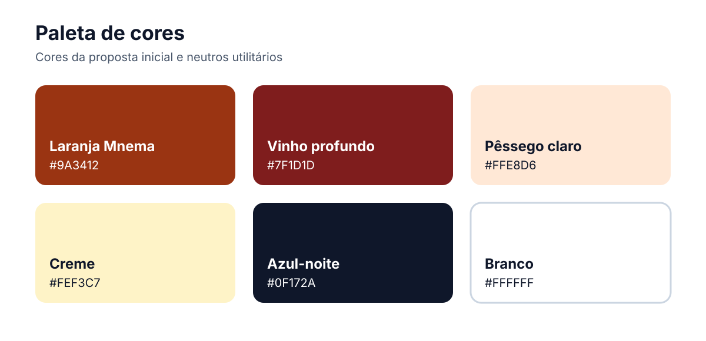

# Identidade Visual — Mnema (nome provisório)

Este documento estabelece as diretrizes iniciais da identidade visual do **Mnema**, nome provisório do aplicativo de apoio ao rastreio cognitivo por meio de tarefas de desenho. As definições orientam a construção do aplicativo, do protótipo e de materiais de comunicação, preservando clareza, sobriedade e acessibilidade.

!!! warning "Nome provisório"
    **MNEMA NÃO É O NOME DEFINITIVO DO PRODUTO.** O nome ainda será validado com o cliente e **pode passar por mudanças**. Caso outro nome seja escolhido, o logotipo, a assinatura verbal e as aplicações descritas neste documento vão ser revisadas.

## Protótipo de referência

A identidade descrita nesta página registra os elementos utilizados no protótipo provisório do aplicativo. Como o arquivo possui acesso protegido, ele deve ser aberto diretamente no Figma.

[Abrir o protótipo no Figma](https://www.figma.com/design/5ItJcn9EA8J4SZsPSP7N04/UNIEURO-MED-APP?node-id=0-1&p=f&t=2dh7DnCIHmLi4ty8-0){ .md-button .md-button--primary }

senha: senhaincorreta

## Fundamentos da marca

### Contexto e público

Na primeira etapa, o usuário principal é o **pesquisador ou profissional de saúde**, com alto nível de instrução, mas sem pressupor familiaridade com tecnologia. Esse profissional orienta o **paciente idoso**, que é o público secundário no MVP e deverá conseguir realizar as tarefas com autonomia nas evoluções futuras.

A identidade deve, portanto, comunicar:

- **clareza**, evitando elementos ambíguos e excesso de informação;
- **confiança**, adequada a um contexto de pesquisa e saúde;
- **acolhimento**, sem infantilizar o paciente idoso;
- **sobriedade**, usando a cor de forma funcional;
- **acessibilidade**, com leitura e interação confortáveis.

### Nome

Os nomes considerados foram Mnema, NeuroB, Neuri, Traço, Nooma e Cognara. A proposta visual recebida utiliza **MNEMA**; por isso, este documento emprega esse nome apenas como referência de trabalho. **A escolha não é definitiva e o nome pode ser substituído** após a avaliação e a confirmação formal do cliente.

## Logotipo

A proposta inicial combina um monograma **M** branco com uma base quadrada de cantos arredondados em tons de laranja e vinho. O nome aparece em caixa alta e em tom escuro, criando uma assinatura simples e reconhecível em telas pequenas.

<figure class="brand-logo">
  
  <figcaption>Reconstrução vetorial provisória baseada no protótipo inicial.</figcaption>
</figure>

### Aplicações da marca

| Versão | Uso definido |
|---|---|
| Assinatura vertical | Abertura do aplicativo, apresentações e capas |
| Símbolo | Ícone do aplicativo e espaços reduzidos |

### Área de proteção e redução

- Manter ao redor da marca uma margem mínima equivalente a **1/4 da largura do símbolo**.
- Não exibir o símbolo com menos de **32 px** em meios digitais.
- Na assinatura completa, não reduzir a ponto de o nome ter altura inferior a **16 px**.
- Aplicar a assinatura completa sobre fundo branco ou outro fundo claro e liso.

### Usos indevidos

Não distorcer, inclinar, rotacionar ou reorganizar os elementos; não substituir as cores por tons não previstos; não aplicar sombras ou contornos adicionais; e não posicionar a marca sobre imagens que prejudiquem sua leitura.

## Tipografia

### Família tipográfica

A família tipográfica utilizada no protótipo e definida para o aplicativo é **Inter**. Ela deve ser usada em todos os textos da interface, incluindo títulos, instruções, botões, campos e mensagens.

Quando a Inter não estiver disponível, a interface deve usar a seguinte ordem de substituição:

```css
font-family: Inter, Arial, sans-serif;
```

O produto utiliza **Inter Regular (400)** nos textos corridos, **Inter Semi Bold (600)** nos botões e rótulos e **Inter Bold (700)** nos títulos.

<div class="type-specimen" aria-label="Amostra da tipografia definida para o aplicativo">
  <p class="type-caption">INTER BOLD · 700</p>
  <p class="type-display">Instruções do teste</p>
  <p class="type-caption">INTER REGULAR · 400</p>
  <p class="type-body">Desenhe um relógio marcando onze horas e dez minutos.</p>
  <p class="type-characters">Aa Bb Cc · 0123456789</p>
</div>

!!! warning "Caixa alta"
    A caixa alta deve ficar restrita ao **logotipo**, siglas e rótulos muito curtos. Em instruções, botões e textos corridos, usar maiúsculas e minúsculas normalmente: o contorno variado das palavras facilita a leitura. Não usar espaçamento excessivo entre letras; no corpo, manter o valor normal da fonte.

## Paleta de cores

As cinco cores informadas no protótipo continham uma repetição de `#FFE8D6`. Assim, a paleta de marca possui **quatro cores únicas**. Foram acrescentados um neutro escuro e o branco como cores utilitárias para garantir contraste e formar uma interface completa.



### Aplicação das cores

| Cor | Uso no aplicativo |
|---|---|
| **Laranja Mnema** `#9A3412` | Botões principais, contornos de botões secundários, ícones e indicadores de progresso das tarefas |
| **Vinho profundo** `#7F1D1D` | Avisos críticos, ações de desistência e faixas de forte destaque na apresentação dos resultados |
| **Pêssego claro** `#FFE8D6` | Blocos com instruções, fundos de ícones e mensagens auxiliares durante os testes |
| **Creme** `#FEF3C7` | Destaques informativos, classificações de resultado e telas de encerramento destinadas ao paciente |
| **Azul-noite** `#0F172A` | Títulos, textos principais, logotipo e traços dos desenhos apresentados na interface |
| **Branco** `#FFFFFF` | Cartões, formulários, área de desenho e superfícies principais de conteúdo |

## Diretrizes de acessibilidade

- Manter alvos de toque com pelo menos **48 × 48 dp** e espaçamento suficiente entre ações.
- Escrever instruções curtas, diretas e com uma ação por etapa.
- Evitar texto justificado, itálico em blocos longos e pesos muito finos.
- Permitir ampliação de texto sem perda de conteúdo ou funcionalidade.
- Exibir rótulos junto aos ícones; não pressupor que o usuário reconheça apenas o símbolo.
- Preservar contraste visível nos estados de foco e seleção.
- Realizar testes de usabilidade com profissionais e idosos antes de consolidar a identidade.

## Pendências para consolidação

- Confirmar formalmente o nome **Mnema**.
- Receber o logotipo original em formato vetorial (`SVG` ou `PDF`).
- Definir e documentar as assinaturas horizontal, monocromática e reduzida.
- Validar a tipografia e a paleta em testes com o público-alvo.
- Definir tokens funcionais de sucesso, alerta, erro e informação.

## Referências

- [WCAG 2.2 — Contraste mínimo](https://www.w3.org/WAI/WCAG22/Understanding/contrast-minimum.html)
- [WCAG 2.2 — Uso de cor](https://www.w3.org/WAI/WCAG22/Understanding/use-of-color.html)
- [Android Accessibility — tamanho do alvo de toque](https://support.google.com/accessibility/android/answer/7101858)

## Histórico de versões

| Versão | Descrição | Autor | Data | Revisor | Data de revisão |
|---|---|---|---|---|---|
| 1.0 | Criação da identidade visual inicial a partir do questionário do cliente, do protótipo e da paleta fornecida | [Mach1r0](https://github.com/Mach1r0) | 22/09/2026 | [Eduardo Ferreira](https://github.com/eduardoferre) | 23/09/2026 |
| 1.1 | Alinhamento das definições ao protótipo: adoção da fonte Inter, inclusão do Figma e simplificação das seções | [Mach1r0](https://github.com/Mach1r0) | 22/09/2026 | [Eduardo Ferreira](https://github.com/eduardoferre) | 23/09/2026 |
| 1.2 | Remoção da incorporação protegida do Figma e documentação do uso das cores nas telas | [Mach1r0](https://github.com/Mach1r0) | 22/09/2026 | [Eduardo Ferreira](https://github.com/eduardoferre) | 23/09/2026 |
