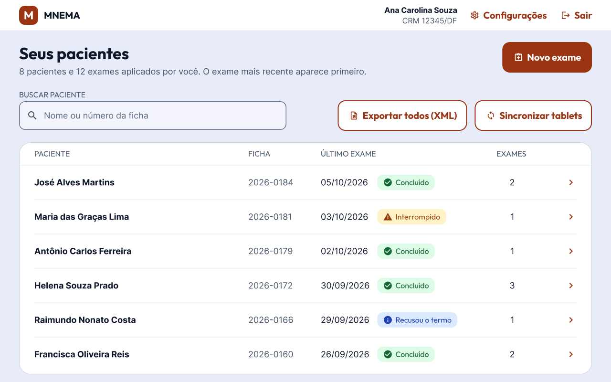
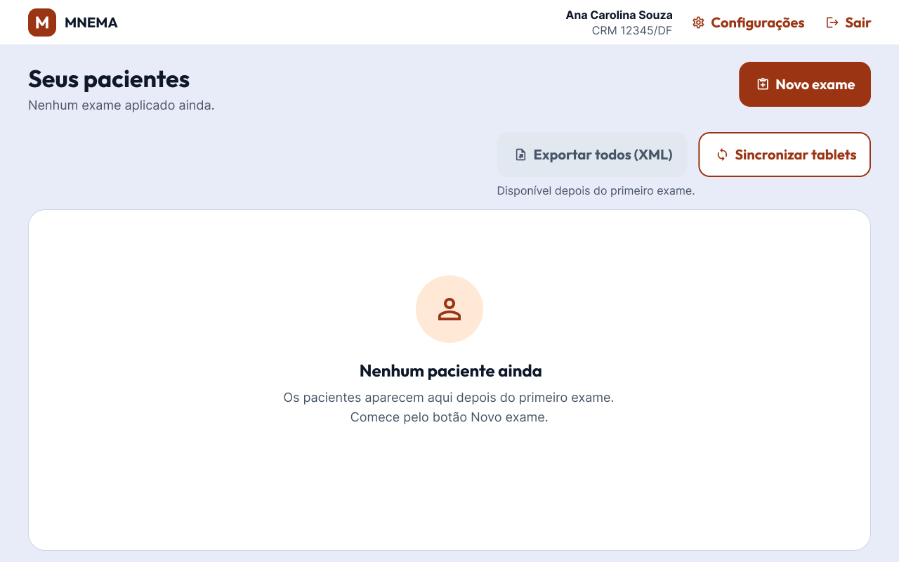
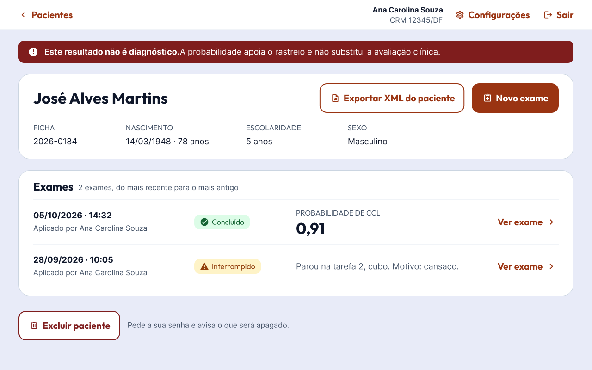
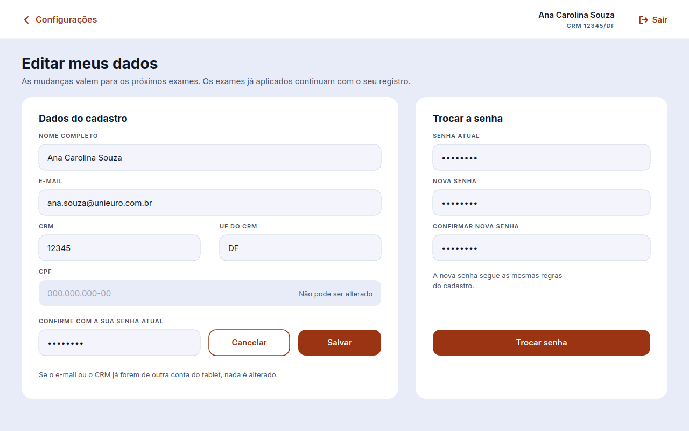
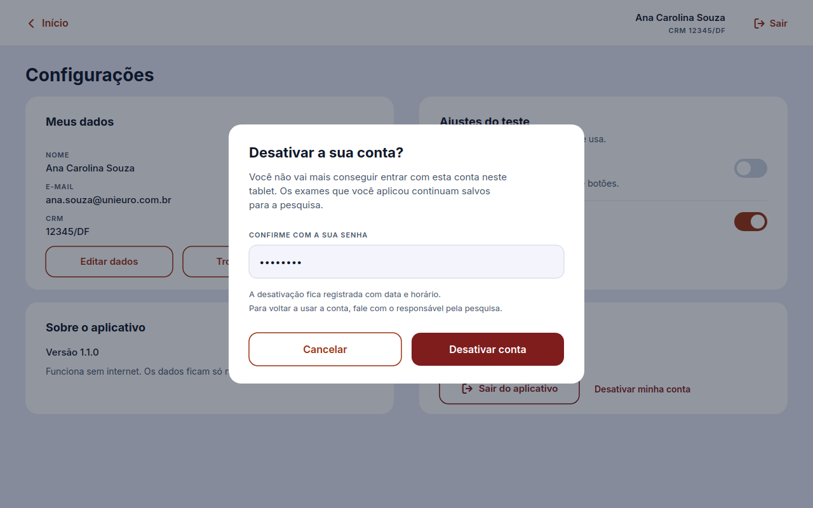
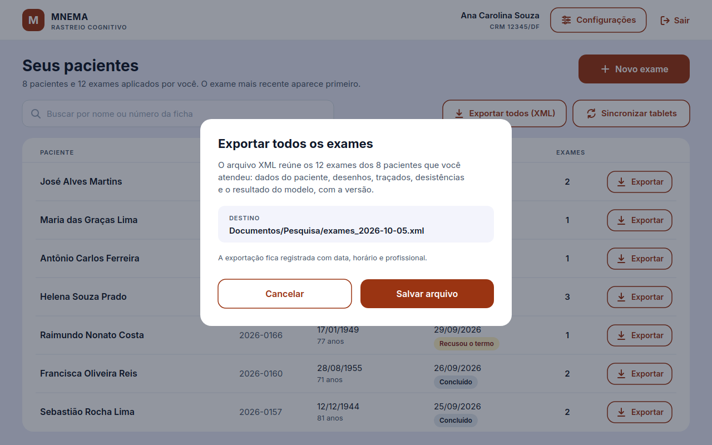
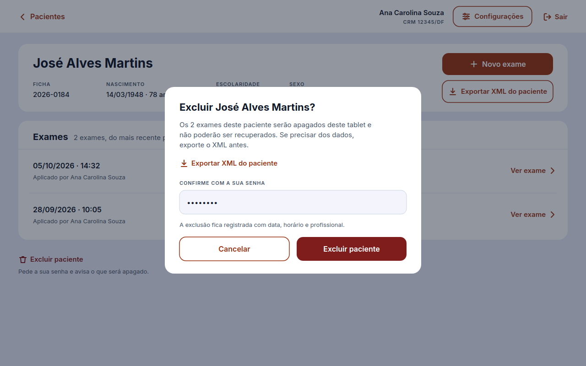
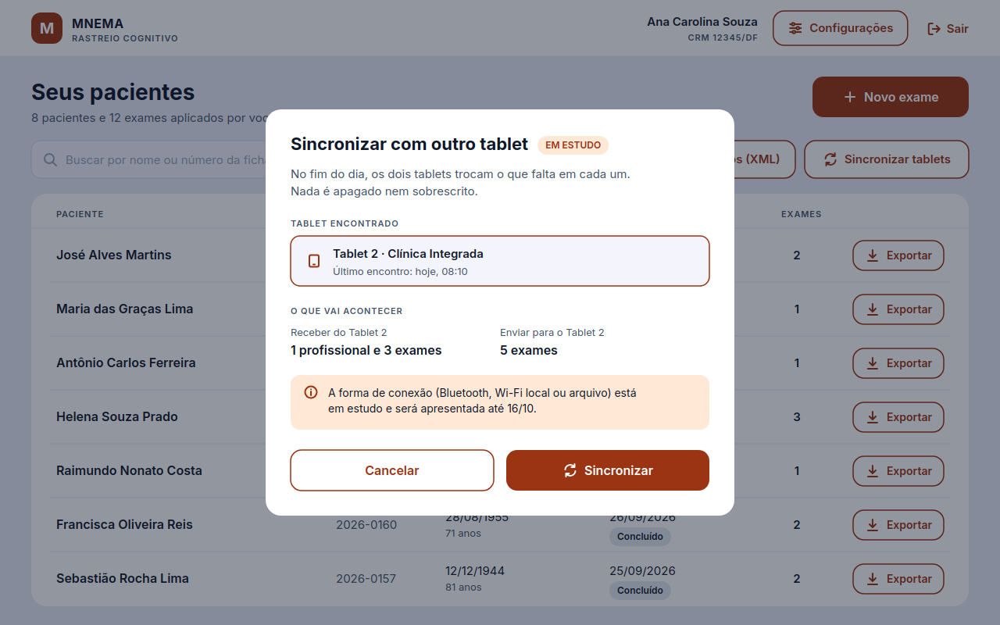
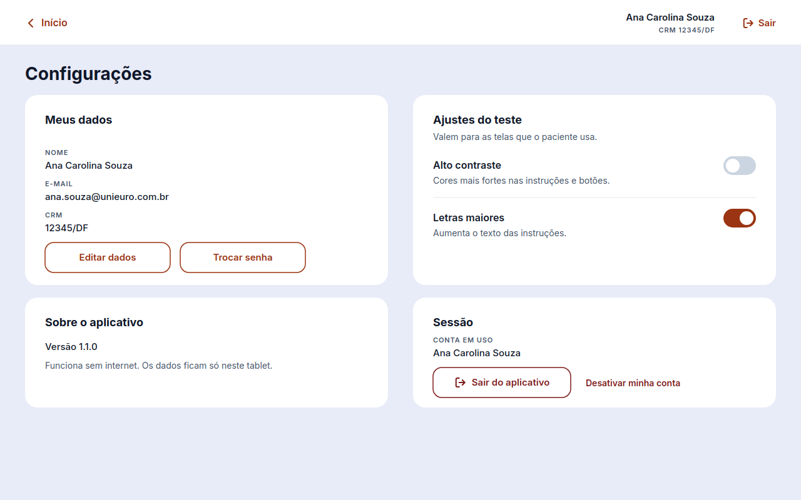
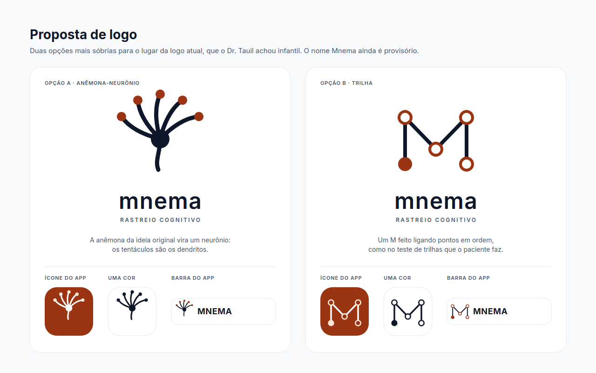

# Protótipo da área do profissional

Esta página reúne as telas da área do profissional, desenhadas a partir do que o *Product Owner* pediu na avaliação da R1, em 02/10/2026. Segundo ele, a tela que aparece depois do login "acabou ficando esquecida". Ela precisa trazer os pacientes atendidos, o botão de novo exame, a exportação dos dados, a sincronização entre tablets e as configurações.

!!! info "Situação em 05/10/2026"
    A **tela inicial** ([APP #46](https://github.com/fga-eps-mds/2026.2-UNB-FCTE_UNIEURO_MED-APP/issues/46)) e a **conta do profissional** ([APP #54](https://github.com/fga-eps-mds/2026.2-UNB-FCTE_UNIEURO_MED-APP/issues/54) e [APP #55](https://github.com/fga-eps-mds/2026.2-UNB-FCTE_UNIEURO_MED-APP/issues/55)) vão para validação com o PO e o cliente na reunião de 05/10. As demais telas são propostas para as próximas histórias e ainda não foram validadas.

O arquivo-fonte fica no Figma, na página "Área do profissional" do [protótipo](https://www.figma.com/design/5ItJcn9EA8J4SZsPSP7N04/UNIEURO-MED-APP?node-id=0-1&p=f&t=2dh7DnCIHmLi4ty8-0). As imagens abaixo são as mesmas telas. Os arquivos `.svg` da [pasta das imagens](https://github.com/fga-eps-mds/2026.2-UNB-FCTE_UNIEURO_MED-DOCS/tree/main/docs/assets/imagens/prototipo/area-do-profissional) podem ser arrastados para o Figma e viram camadas editáveis.

## Tela inicial

História: [APP #46](https://github.com/fga-eps-mds/2026.2-UNB-FCTE_UNIEURO_MED-APP/issues/46). Tarefa do protótipo: [DOCS #83](https://github.com/fga-eps-mds/2026.2-UNB-FCTE_UNIEURO_MED-DOCS/issues/83).

### Com pacientes

- No topo ficam o nome e o CRM de quem entrou, as configurações e o botão de sair.
- O botão de novo exame fica em destaque, no lugar do cartão "Vamos começar?" da R1.
- A lista mostra só os pacientes do profissional autenticado, porque um médico não pode ver o que outro coletou (cliente, Discord, 24/09). O exame mais recente aparece primeiro.
- A busca aceita parte do nome ou o número da ficha.
- Cada linha mostra a situação do último exame e tem o botão de exportar só os exames daquele paciente. "Exportar todos (XML)" fica junto da busca.
- O resultado do modelo não aparece na lista, só dentro do exame.

### Primeiro acesso

Sem pacientes, a lista explica onde começar, e a exportação fica desabilitada.

### Exames de um paciente

Abre ao tocar em um paciente da lista. O resultado aparece como probabilidade de comprometimento cognitivo leve, porque o modelo separa CCL de não CCL. A exclusão do paciente fica afastada das outras ações.

## Conta do profissional

Completa o CRUD do profissional, que o professor apontou como incompleto em 05/10: o cadastro ([APP #5](https://github.com/fga-eps-mds/2026.2-UNB-FCTE_UNIEURO_MED-APP/issues/5)) e o login ([APP #6](https://github.com/fga-eps-mds/2026.2-UNB-FCTE_UNIEURO_MED-APP/issues/6)) já existiam, mas faltavam a atualização e a exclusão. As duas telas abrem a partir das configurações.

### Editar os meus dados e trocar a senha

História: [APP #54](https://github.com/fga-eps-mds/2026.2-UNB-FCTE_UNIEURO_MED-APP/issues/54).

- Salvar as alterações e trocar a senha pedem a senha atual.
- O CPF aparece só para leitura, porque identifica o profissional. A confirmar com o PO.

### Desativar a conta

História: [APP #55](https://github.com/fga-eps-mds/2026.2-UNB-FCTE_UNIEURO_MED-APP/issues/55).

A exclusão é uma desativação: a conta deixa de entrar, mas os exames aplicados continuam no tablet para a pesquisa.

## Propostas para as próximas histórias

Estas telas ainda não foram validadas com o PO e o cliente.

??? note "Exportar todos os exames — APP #22"
    

??? note "Excluir paciente — APP #47"
    

??? note "Sincronizar tablets — em estudo na DOCS #81"
    

    A forma de conexão (Bluetooth, Wi-Fi local ou arquivo) depende do estudo da DOCS #81.

??? note "Configurações do profissional"
    

    Os ajustes do teste, alto contraste e letras maiores, vêm da história APP #24. Editar os dados e desativar a conta são as histórias APP #54 e #55.

??? note "Proposta de logo — DOCS #84"
    

    Resposta ao pedido do cliente de 24/09: o Dr. Tauil achou a logo atual infantil e preferiu algo mais sóbrio.

## Decisões de design

- Botões com maiúsculas e minúsculas; caixa alta só em rótulos curtos, como pede a [identidade visual](identidade-visual.md).
- Cores, fonte e tamanho dos quadros (1280 × 800) seguem o protótipo existente.
- Ações destrutivas, como excluir paciente, ficam longe das outras e pedem a senha do profissional.

## Histórico de versões

| Versão | Descrição | Autor | Data | Revisor | Data de revisão |
|---|---|---|---|---|---|
| 1.0 | Criação da página com a tela inicial para validação e as propostas das telas seguintes | [Vitor Carvalho Pereira](https://github.com/vcpVitor) | 05/10/2026 | | |
| 1.1 | Inclusão das telas da conta do profissional: editar dados, trocar a senha e desativar a conta | [Vitor Carvalho Pereira](https://github.com/vcpVitor) | 05/10/2026 | | |
